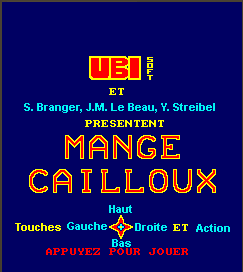

# Project Name
 
Portage du jeu Mange Cailloux CPC en J2ME.

## Installation
 
Installer un IDE JAVA permettant l'utilisation de CLDC 2.5.2_01 avec le SDK J2ME 3
 
## Usage

Mange-caillou est un jeu de réflexion dont le but principal est d’aligner 3 diamants. 
Pour cela, on a le contrôle du héros, un mange-caillou, qui a la capacité de déplacer toutes les briques de la carte, ainsi que de « manger » les briques qui ne sont pas de diamant.Pour compliquer un peu la tâche, il y a des ennemis qui peuvent tuer notre héros. 
Ils ont eu aussi la capacité de manger les briques. 
Enfin il existe un second enjeu : réaliser le meilleur score possible afin de figurer dans le tableau des meilleurs joueurs. 
Pour cumuler le meilleur score possible, on peut aussi tuer les ennemis de différentes façons, incluant ainsi des quotas de points par façon de tuer. 

 
## Contributing
 
1. Fork it!
2. Create your feature branch: `git checkout -b my-new-feature`
3. Commit your changes: `git commit -am 'Add some feature'`
4. Push to the branch: `git push origin my-new-feature`
5. Submit a pull request :D
 
## Credits
 
Yohann Streibel - Software engineer
 
## License
 
All rights reserved